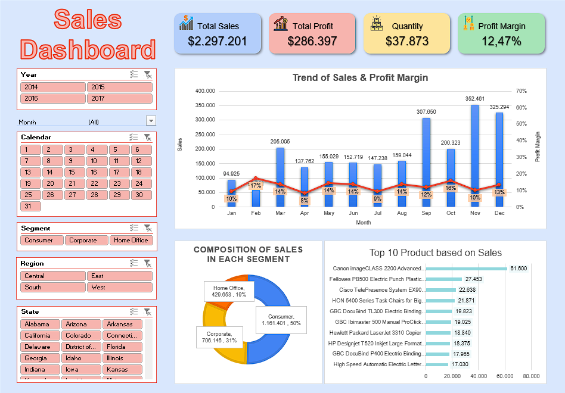

# 📊 Sales Analysis Dashboard (Microsoft Excel)

This project is part of my self-learning journey to develop analytical skills using Microsoft Excel.  
The dashboard was created to provide an interactive and informative overview of sales performance based on real-world business questions.

---

## 🎯 Project Objectives

- Calculate key metrics such as Total Sales, Profit, Quantity, and Profit Margin.
- Analyze monthly sales trends to identify growth patterns.
- Visualize sales composition by segment.
- Identify the Top 10 best-selling products based on total sales.
- Display an informative product table including Category, Product Name, Sales, Profit, and Quantity.
- Add slicers and filters for dynamic exploration of the data (by Month, Date, and Region).

---

## 💡 **Features**

- **Total Sales, Profit, Quantity, and Profit Margin Overview**
- Interactive filters for:
  - Year, Month, Calendar Day
  - Customer Segment
  - Region & State
- **Trend Analysis** of Sales & Profit Margin across months.
- **Composition of Sales** by Customer Segment (Pie Chart).
- **Top 10 Products** based on Total Sales (Bar Chart).

---

## 🛠 Tools Used

- Microsoft Excel  
- PivotTable  
- Power Pivot  
- Data Visualization Charts
- Slicer  
- Formulas (including LOOKUP, IF, SUMIF, etc.)

---
## 🧠 **Key Insights**

- Consumer segment contributes **50%** of total sales.
- Highest sales month: **November** ($352,461).
- Top product: **Canon imageCLASS 2200 Advanced Copier** with $61,600 in sales.
- Overall **Profit Margin** is **12.47%**.

---

## 📸 Dashboard Preview

---

## 📄 Files Included

- [`Case_Study_1_Sales_Analysis.xlsx`](Case_Study_1_Sales_Analysis.xlsx) – Main dashboard file created in Microsoft Excel.

---

## 👩‍💻 About Me

I'm Tya Dwi Rahayu, a Physics graduate pursuing a career in Data and IT.  
I’m passionate about transforming data into meaningful insights through analysis, visualization, and hands-on projects.  
Feel free to connect and collaborate!

---
